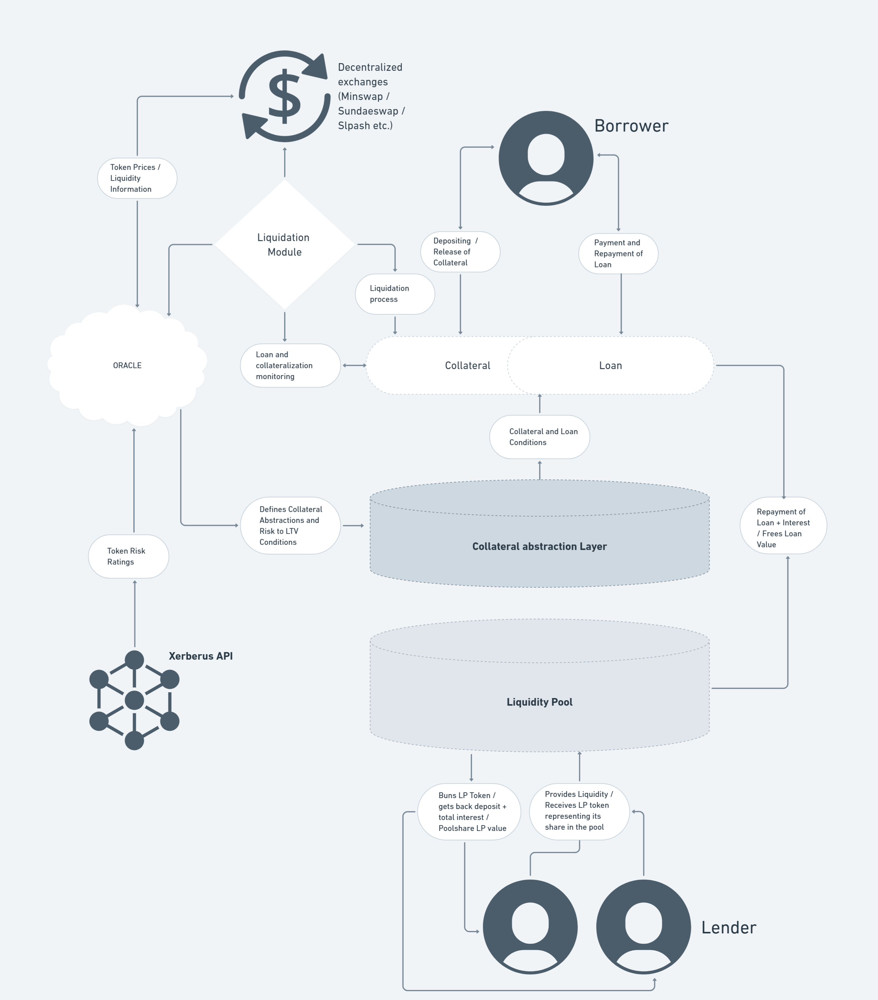

# XerLend Specification

A risk-based DApp on the Cardano blockchain for lending and borrowing that uses Xerberus Risk Ratings to optimise collateral/loan ratios to ensure the highest possible security for Lender and Borrower at a max Loan to value ratio and thus offers greater effectiveness for the use of users' capital.

## 1. Overview

Xerlend is a decentralized ADA lending protocol on the Cardano blockchain that allows users to borrow ADA by pledging Cardano Native Tokens (CNTs) as collateral.

The system uses dynamic risk assessment via the Xerberus Risk Ratings to determine key loan parameters—such as Loan-to-Value (LTV) ratios, and interest rates. In addition, XerLend offers ADA holders the opportunity to earn interest by depositing their ADA into a shared lending pool.

The protocol employs real-time monitoring of collateral values and Health Factors, triggering automated liquidation if risk thresholds are breached. This design ensures that larger loans remain appropriately collateralized and that both borrowers and lenders are protected through transparent, rule-based smart contracts.

## 2. Architecture

The XerLend system comprises six core components:

1. **Lending Pool Contract:**  
   Handles ADA deposits from lenders, issuance of Pool Share Tokens (LP tokens), and distribution of accrued interest.

2. **Collateral & Loan Contract:**  
   Manages borrower interactions including collateral deposit, loan creation, borrowing ADA, repayment, and liquidation.

3. **Update Parameters Contract:**  
   Manages Protocol Parameters for adjusting fee structure, collateral value calculation, risk management structure and admin rights.

4. **Oracle Contract:**  
   Ensures that risk ratings and collateral value calculations are always trusted, verified, and available on chain.

5. **Risk Rating Integration Module:**  
   Interfaces with the external Xerberus Risk Rating API to dynamically assess the creditworthiness of the collateral tokens.

6. **Liquidation Module:**  
   Ensures that the protocol always remains healthy by liquidating loans falling below a certain health threshold.

### Overview of the Architecture

## 3. Specifications

### 3.1 Actors

- **Borrower:**  
  Lenders deposit their ADA into a shared liquidity pool, enabling the protocol to function. In return, they earn interest on their contributions. Their funds provide the capital that borrowers tap into, making them essential for maintaining the pool’s liquidity and overall health.

- **Lender:**  
  Borrowers access funds from the pool by putting up collateral. If the value of their collateral drops below a certain threshold, the protocol may trigger liquidation to safeguard the system.

- **Risk Rating Provider:**  
  The external Xerberus Risk Rating service that supplies up-to-date risk evaluations for various CNTs.

- **Liquidation Module:**  
  The DEX module continuously monitors liquidity levels across the protocol, including all available liquidity pools. If liquidity drops below a certain threshold, the system automatically initiates corrective measures—such as triggering liquidations—to safeguard overall market stability and maintain robust risk controls.

- **Admin:**  
  An authorized entity responsible for updating global configuration settings, including risk thresholds, LTV ratios, and interest rate parameters.

- **Decentralized Exchange (DEX):**  
  The integration with the DEX enables direct, real-time tracking of collateral values, serving to promptly liquidate collateral when risk thresholds are breached. Additionally, it continuously monitors available liquidity pools to ensure overall system stability.

### 3.2 Tokens

#### Pool LP Token
A unique LP Token issued during pool deposit to authenticate the legitimacy of the share of value inside the pool.
- **LpTokenSymbol:** Defined by the protocol’s minting policy.
- **TokenName:** Specified in the minting policy parameters (e.g., "XLLP").

#### Share Price Concept

Share Price at any time t is defined as:  ΔT = d / Share Price(t)

#### Withdraw (Burning Tokens)
- **LpTokenSymbol:** Defined by the protocol’s minting policy.
- **TokenName:** Specified in the minting policy parameters.
- **Pool Share Token (LP Token):**  
  Represents a lender’s proportional share in the lending pool and is minted upon ADA deposit.
  - **CurrencySymbol:** Governed by the protocol’s minting policy.
  - **TokenName:** Derived from the pool identifier.

#### Collateral Tokens
These are the Cardano Native Tokens deposited by borrowers as collateral.  
*(Note: These tokens are external to the protocol and are not minted by the XerLend Protocol.)*

### 3.3 Smart Contracts

#### 3.3.1 Lending Pool Contract

The Lending Pool Contract is responsible for managing ADA deposits and withdrawals within the Xerlend protocol. It tracks the pool’s state via a datum structure, handles the minting and burning of Pool Share Tokens (LP tokens), and ensures that all transactions conform to strict validation rules. It is integral to maintaining liquidity in the Xerlend protocol. It securely handles ADA deposits and withdrawals, ensuring that the pool's balance and the corresponding LP tokens are always in sync.

##### 3.3.1.1 PoolDatum

This type maintains the current state of the pool:
- **balance:** Lovelace – Represents the total ADA (in lovelace) held by the pool.
- **total_lp_tokens:** Int – The total number of LP tokens minted, which represent the pool shares.
- **lend_out:** Lovelace – Total ADA in Loans.

##### 3.3.1.2 Redeemer (Action)

This enumerated type defines the two possible actions that can be performed:
- **Mint(Int, Int):** A deposit action where:
  - The first parameter is the deposit amount (ADA added to the pool).
  - The second parameter is the number of LP tokens to be minted for the depositor.
- **Burn(Int, Int):** A withdrawal action where:
  - The first parameter is the withdrawal amount (ADA to be removed from the pool).
  - The second parameter is the number of LP tokens to be burned (removed from circulation).

##### 3.3.1.3 Functions / Validations

**Minting Function (for Deposits and Withdrawals):**
- The mint function validates that the amount of LP tokens minted (or burned) during a transaction corresponds exactly to the action specified in the redeemer:
  - **For Deposits (Mint Action):**
    - When the redeemer is `Mint(deposit_amount, lp_amount)`, the function checks that the mint quantity extracted from the transaction equals `lp_amount`.
    - This ensures that when a user deposits ADA into the pool, the exact number of LP tokens that represents their share is minted.
  - **For Withdrawals (Burn Action):**
    - When the redeemer is `Burn(withdraw_amount, lp_amount)`, the function verifies that the mint quantity equals the negative of `lp_amount`.
    - This ensures that LP tokens are correctly burned (i.e., removed) when a user withdraws ADA from the pool.

**Spend Function (for State Transitions):**
- The spend function validates that the state transition of the pool (i.e., the change in balance and LP tokens) adheres to the rules defined by the deposit or withdrawal action.
- **UTxO Identification and Datum Extraction:**
  - It locates the specific pool UTxO being spent by matching the provided output reference.
  - It extracts the current `PoolDatum`, which contains the current balance, total_lp_tokens, and loans amount.
  - It also verifies that the UTxO’s address corresponds to the pool’s script-derived address.
- **Validation for Deposit (Mint Action):**
  - The new (output) datum must reflect an increased balance equal to the sum of the previous balance and the deposit amount.
  - The new total LP tokens must equal the previous total plus the minted LP tokens.
  - Additionally, it confirms that the minted quantity in the transaction matches the LP tokens specified.
- **Validation for Withdrawal (Burn Action):**
  - The output datum must show a decreased balance equal to the previous balance minus the withdrawal amount.
  - The LP tokens should decrease accordingly, ensuring that the difference between the input and output LP tokens equals the number of tokens burned.
  - The contract also ensures that the resulting balance is not negative.

#### 3.3.2 Collateral & Loan Contract

The Collateral & Loan Contract is responsible for managing the lifecycle of a loan secured by collateral. Borrowers deposit Cardano Native Tokens (CNTs) as collateral, and based on the associated Xerberus Risk Rating, the contract calculates the maximum borrowable ADA, enforces loan parameters (such as the Health Factor and loan duration), and handles state transitions for borrowing, repayment, and liquidation. This contract ensures that each state transition is valid and that the collateral remains properly secured against the outstanding loan.

**Collateral Management:**
- The Collateral & Loan Contract is central to managing the borrower’s risk. It dynamically adjusts loan parameters based on the collateral’s risk rating and ensures that loans remain within safe limits.

**Loan Lifecycle:**
- Borrowers interact with this contract to deposit collateral, borrow ADA, repay loans, and, if necessary, trigger liquidation. The contract’s strict validations protect both borrowers and lenders by enforcing collateralization rules.

**State Consistency:**
- By updating a dedicated datum (the `CollateralDatum`), the contract maintains a clear and immutable record of each loan’s state. This record is critical for calculating the Health Factor, determining eligibility for further borrowing, and managing risk.

##### 3.3.2.1 Collateral Datum

`CollateralDatum` holds the current state of a loan secured by collateral:
- **collateral:** Int  
  The total collateral amount deposited (e.g., measured in lovelace or a token’s minimal unit).
- **risk_rating:** RiskRating  
  The risk classification of the collateral, typically represented by an enumeration (e.g., A, B, or C) obtained from the Xerberus Risk API.
- **borrowed:** Int  
  The current ADA amount that has been borrowed against the collateral.
- **health_factor:** Decimal  
  A real-time metric indicating the safety of the loan (a value above 1.5 is considered safe, while values below 1.0 trigger liquidation).
- **loan_duration:** Int  
  The maximum allowed duration for the loan in seconds.

##### RiskRating (Enumeration)

- A type representing the risk categories:
  - AAA, AA, A, BBB, BB, B, CCC, CC, C, D
- Each category implies different LTV ratios, interest rates, and maximum loan durations.

##### Action (Redeemer)

The redeemer for the contract specifies the intended operation. It can be one of:
- **Deposit(Int, RiskRating):**  
  A deposit action where the borrower provides additional collateral. The parameters are the deposit amount and an updated risk rating (which might be recalculated by the external oracle).
- **Borrow(Int):**  
  An action to borrow a specific amount of ADA based on the current collateral and risk rating.
- **Repay(Int):**  
  An action to repay a specified amount of the borrowed ADA. If the full loan is repaid, the collateral can be unlocked.
- **Liquidate:**  
  An action that triggers liquidation when the Health Factor falls below a safe threshold (e.g., less than 1.0).

##### 3.3.2.4 Validation

**Deposit (Collateral Increase):**
- **Purpose:** Allow borrowers to add collateral and possibly update the risk rating.
- **Validation:**
  - The output datum must reflect an increased `collateral` field equal to the sum of the existing collateral and the deposited amount.
  - The risk rating is updated to the new value (as determined, for example, by an external oracle).
  - Other fields such as `borrowed`, `health_factor`, and `loan_duration` remain unchanged.

**Borrow (Loan Issuance):**
- **Purpose:** Enable borrowers to obtain ADA up to a maximum determined by their collateral and its risk rating.
- **Validation:**
  - The contract computes the maximum loan amount using the helper function `max_loan_amount` based on the current collateral and risk rating.
  - It then verifies that the new borrowed amount (existing plus the requested amount) does not exceed the maximum allowable limit.
  - The output datum is updated to reflect the new borrowed total while leaving the collateral and risk rating unchanged.

**Repay (Loan Repayment):**
- **Purpose:** Allow borrowers to repay part or all of the borrowed ADA.
- **Validation:**
  - The repayment amount must not exceed the outstanding borrowed amount.
  - The output datum shows a reduction in the `borrowed` field by the repayment amount.
  - If the full amount is repaid, additional logic (not fully shown here) might reset the Health Factor or unlock the collateral.

**Liquidate (Forced Liquidation):**
- **Purpose:** Protect the protocol by liquidating the collateral when the loan becomes under-collateralized (i.e., when the Health Factor drops below a critical threshold).
- **Validation:**
  - The validator ensures that liquidation is triggered only when the Health Factor is below the safe threshold (e.g., less than 1.0).
  - In the output datum, the `borrowed` field must be set to zero, indicating that the loan is effectively repaid (or that the collateral is being reclaimed through liquidation).
  - The specifics of collateral transfer during liquidation would be handled by additional off-chain or on-chain processes.

#### 3.3.3 Update Protocol Parameters Smart Contract

**Purpose:**  
The Update Protocol Parameters Smart Contract is responsible for modifying protocol‑wide settings in Xerlend. These settings include risk thresholds, fee parameters, and the protocol administrator’s address. The contract ensures that updates occur only through authorized channels and that only the specified fields are modified while all other parameters remain unchanged.

**Data Structures**

- **ProtocolParametersDatum:**  
  This datum holds the current protocol settings:
  - **risk_threshold:** Decimal – The threshold used to determine when loans become risky.
  - **base_fee_numerator:** Int – The base fee used for fee calculations within the protocol.
  - **admin:** Address – The current administrator’s address who is authorized to update these parameters.

**Action**

Enumerates the possible update actions:
- **UpdateRiskThreshold(Decimal):** Update the risk threshold.
- **UpdateFee(Int, Option<Int>):** Update the base fee and, optionally, the fee sharing parameter.
- **UpdateAdmin(Address):** Transfer administrative control to a new address.

**Validator Functions**
- The smart contract uses a spend function that closely mirrors the structure of the Pool Contract’s validator.
  - **Input Extraction:**  
    The contract retrieves the input UTxO and extracts its `ProtocolParametersDatum`, which contains the current settings.
  - **Authentication:**  
    The validator checks that the caller matches the current admin specified in the datum. This ensures only authorized updates.
  - **Action-Based Validation:**  
    Depending on the redeemer’s action, the validator verifies that:
    - For `updateRiskThreshold(new_risk):`  
      The output datum reflects the new risk threshold, while `base_fee_numerator`, `fee_sharing_numerator_opt`, `allowed_batchers`, and `admin` remain unchanged.
  - **Output Consistency:**  
    The output UTxO must be sent to the same smart contract address (i.e. the protocol parameters remain stored at the same location), and its datum must exactly match the expected state after the update.

### 3.4 Transactions

#### 3.4.1 Deposit

A Deposit transaction is initiated by a user to deposit ADA into the Xerlend pool. The pool is represented by a dedicated smart contract address that updates its internal state and mints LP tokens (Pool Share Tokens) in return. These LP tokens represent the user’s share of the pool.

**Transaction Structure:**

- **Inputs:**
  - One or more UTxOs from the user containing the ADA to be deposited.

- **Mint:**
  - The transaction includes a minting operation that is validated by the pool’s smart contract logic.

- **Redeemer:**  
  `Mint(deposit_amount, lp_tokens_minted)`  
  - `deposit_amount` is the amount of ADA the user deposits.
  - `lp_tokens_minted` is the number of LP tokens to be issued.
  - The number of LP tokens minted is calculated based on the deposit amount and the current state of the pool.

- **Outputs:**

  - **Pool UTxO:**
    - **Address:** The dedicated pool address (Xerlend pool smart contract address).
    - **Datum:** A `PoolDatum` object representing the current state of the pool:
      - **balance:** Updated to reflect the previous pool balance plus the new deposit.
      - **lend_out:** Amount to reflect the amount taken out of the pool for loans.
      - **total_lp_tokens:** Updated to reflect the previous number of issued LP tokens plus the newly minted LP tokens.
    - **Value:**
      - Contains the updated ADA amount (old pool balance in ADA plus the deposit balance in ADA).

  - **Change UTxOs:**
    - Any excess ADA not used for the deposit is returned to the user.

  - **Collateral UTxO:**  
    - One UTxO from the user containing enough Lovelace to cover collateral in case of a fail.

**Validation Requirements:**
- The pool validator ensures that:
  - The new pool state (datum) is updated correctly:
    - `output_balance = input_balance + deposit_amount`
    - `output_total_lp_tokens = input_total_lp_tokens + lp_tokens_minted`
  - The minted LP token amount in the transaction’s mint field exactly matches `lp_tokens_minted`.
  - The output address matches the expected pool address and the attached datum adheres to the `PoolDatum` format.

#### 3.4.2 Withdraw

A Withdraw transaction is initiated by a user who wishes to withdraw part of their share from the Xerlend pool. In this transaction, the user submits their LP tokens to the pool, and the pool reduces its internal ADA balance accordingly while burning the corresponding LP tokens.

**Transaction Structure:**

- **Inputs:**
  - One or more UTxOs from the user containing the LP tokens that represent the share to be withdrawn.

- **Mint/Burn:**
  - The transaction includes a burning operation managed by the pool smart contract.

- **Redeemer:**  
  `Burn(withdraw_amount, lp_tokens_burned)`  
  - `withdraw_amount` is the amount of ADA to be deducted from the pool.
  - `lp_tokens_burned` is the number of LP tokens to be burned.
  - The minted field in the transaction must show a negative quantity exactly equal to `lp_tokens_burned`.

- **Outputs:**

  - **Pool UTxO:**
    - **Address:** The pool address (Xerlend Pool smart contract address).
    - **Datum:** An updated `PoolDatum` object reflecting:
      - **balance:** New pool balance computed as `input_balance - withdraw_amount`.
      - **lend_out:** Amount to reflect the amount taken out of the pool for loans.
      - **total_lp_tokens:** New total calculated as `input_total_lp_tokens - lp_tokens_burned`.
    - **Value:**
      - The updated ADA amount (minimum ADA plus the remaining pool balance).
      - The remaining LP tokens (if any) in the token bundle.

  - **Change UTxOs:**
    - Any excess ADA not needed for the withdrawal is returned to the user.

  - **Collateral:**
    - One UTxO from the user containing enough Lovelace to cover collateral in case of a fail.

#### 3.4.3 Take Loan

*(Details to be filled)*

#### 3.4.4 Repay Loan

*(Details to be filled)*

#### 3.4.6 Update Pool Parameters

*(Details to be filled)*

